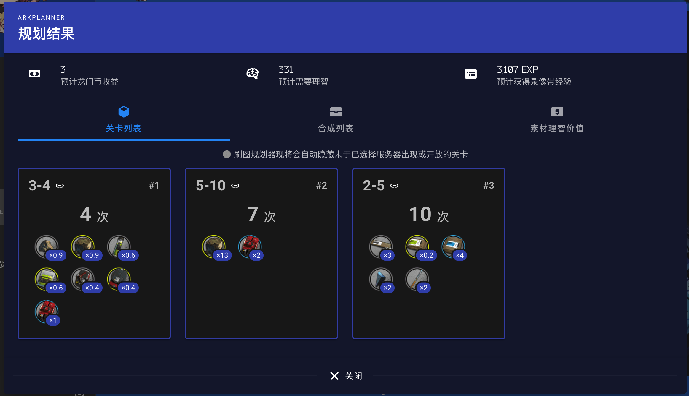

# 明日方舟AirTest自助刷图器
> 当前活动：**玛莉娅·临光**  
> 新活动开启后会在**1-2天内**更新相关关卡
###  5秒钟看懂这是个啥：  
#### 1. 在第三方网站上获得的刷图规划计划  

#### 2. 在刷图器中书写规划代码
```
run([["3-4", 4],["5-10", 7],["2-5", 10]])
```
---
## 1. 使用方法
### 1. PC安装 `Airtest IDE`
访问[`Airtest IDE`官网](http://airtest.netease.com/)，安装相应版本

### 2. 连接设备或模拟器
1. [Android真机连接](https://airtest.doc.io.netease.com/IDEdocs/device_connection/1_android_phone_connection/)  
> [Android连接常见问题](https://airtest.doc.io.netease.com/IDEdocs/device_connection/2_android_faq/) [手机连不上或有问题，八成能在这里找到解决方法]
2. [Android模拟器连接](https://airtest.doc.io.netease.com/IDEdocs/device_connection/3_emulator_connection/) [模拟器必须使用 N * 1080 分辨率，推荐 1920 * 1080]
3. [IOS设备连接](https://airtest.doc.io.netease.com/IDEdocs/device_connection/4_ios_connection/) [IOS要配合Mac进行使用]

### 3. 使用Airtest IDE运行脚本
[下载脚本地址](https://github.com/newsekaes/auto-arknights/releases/)  
> 请确保游戏被打开，且进入看板界面（老婆界面）

1. 下载`.zip`文件
2. 解压缩
3. 使用`Airtest IDE` -> 【文件】-> 【打开脚本】-> 选择打开`arknight.air`文件夹
4. 连接设备或模拟器
5. 在脚本下方输入你想按顺序刷图的代码（参见示例）
6. 点击【运行】-> 【运行脚本】

## 2. 目前支持的关卡及其代码名称
```
主线：
    1：
        1-7
    2：
        2-3
        s2-5
        s2-6
        s2-7
        2-5
        2-6
        s2-8
        s2-9
        2-10
    3：
        3-1
        3-2
        3-3
        s3-1
        s3-2
        3-4
        3-7
        s3-3
        s3-4
        s3-6
    4：
        4-2
        s4-1
        4-4
        4-5
        4-6
        4-7
        4-8
        4-9
        s4-10
        4-10
    5：
        5-1
        5-3
        5-5
        5-7
        5-8
        s5-7
        s5-8
        5-10
    6：
        6-2
        6-4
        6-5
        6-11
        6-12
        6-16
    7：
        7-4
        7-5
        7-6
        7-8
        7-10
        7-12
        7-15
        7-16
        7-17
        7-18
物资筹备：
    ls:
        ls-5
    ap:
        ap-5
    ca:
        ca-5
    ce:
        ce-5
    sk:
        sk-5
芯片搜索：
    pr-a:
        pr-a-1
        pr-a-2
    pr-d:
        pr-d-1
        pr-d-2
    pr-b:
        pr-b-1
        pr-b-2
    pr-c
        pr-c-1
        pr-c-2
火蓝之心-复刻：
    of:
        of-6
        of-7
        of-8
    of-f:
        of-f4
密林悍将归来：
    ri:
        ri-4
        ri-5
        ri-6
        ri-7
        ri-8
踏寻往昔之风：
    fa:
        fa-4
        fa-5
        fa-6
        fa-7
        fa-8
骑兵与猎人（包含复刻）：
    gt:
        gt-1
        gt-2
        gt-3
        gt-4
        gt-5
        gt-6
玛莉娅·临光：
    mn:
        mn-6
        mn-7
        mn-8

```
## 3. 高级：自定义刷图配置
在脚本上方有这么一部分
```
# ================刷图相关的配置在这里=================
# ....阿巴阿巴阿巴....
# ===================================================
```
在脚本下方有这么一部分
```
# ======刷图流程=======
# ....阿巴阿巴阿巴....
# ===================
```
### 1. 如果想刷的关不在上述列表，且只是想对某一关刷到天荒地老
> 首先，保证关卡处于"可代理状态"；  
> 然后，运行脚本前，记得点开要刷的关卡，勾选游戏内右下角的【代理指挥】

直接在脚本下方 `刷图流程` 里保留唯一一行代码
```
# ======刷图流程=======
fight(999)
# ===================
```
当然`999`表示次数，你可以自定义自己想刷多少次

### 2. 不想自动碎石嗑体力或无限碎石怎么办
```
# 是否使用理智补给：'none'不用，'potion'仅使用药剂，'rock'使用药剂+源石
USE_SUPPLY = 'rock'

# 如果设置了可用源石，那么单次运行，允许使用的最大源石数； 如果设为-1，则无限碎石头
max_rock_num = 10
```
如果不想嗑药不想碎石，就改成 `'none'`; 如果只想使用药剂，改为`'potion'`

### 3. 如果是高等级大佬了，可以尝试关闭等级检测
```
# 开启升级检测功能。关闭此检测后，关卡结束会更快，满级大佬必备
LEVEL_UP_CHECK = False
```

### 4. 开启代理失败检测，以防万一
如果你怕代理失败了影响运行，可以开启此功能
```
# 开启代理失败检测，True开启，False关闭。如果对自己的代理有信心，关闭即可
PROXY_ERROR_CHECK = False
```
